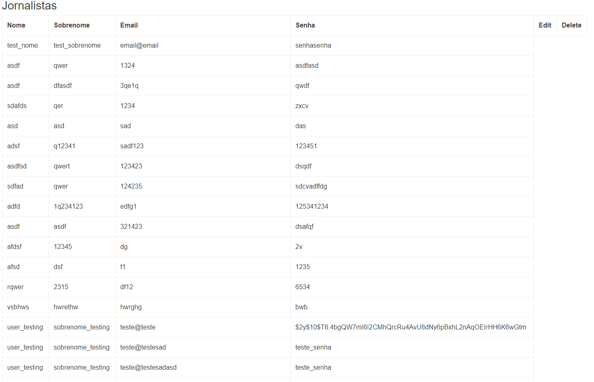

#API para Jornalistas

## About
Este repositório visa disponibilizar uma RESTful API voltada para 
jornalistas, [projeto
originalmente proposto pelo Grupo de Comunicação O POVO](https://github.com/opovoonline/teste-backend-pleno).

### Screenshots
- Register
  > 
  > 
 - Display
  >

### Working Routes
- **POST /api** - Display de todos os usuários (jornalistas) cadastrados.
- **POST /api/register** - Registro de jornalista.

### Technologies

- **PHP Framework: [Laravel](https://laravel.com/)**
- **Database: [MySQL](https://www.mysql.com/)**
- **Authentication: [JWT](https://jwt.io/)**
- **Development Environment: [WampServer](https://www.wampserver.com/en/)**